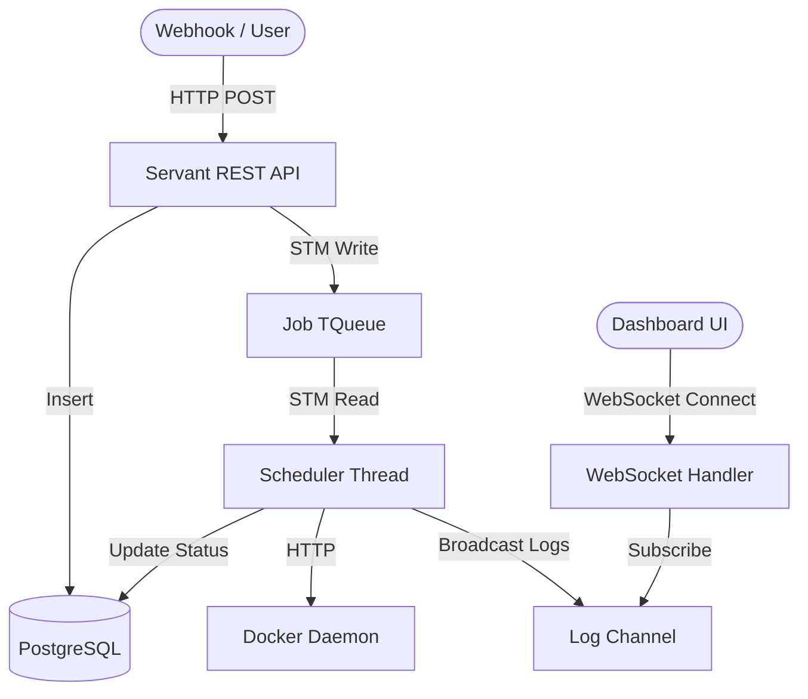
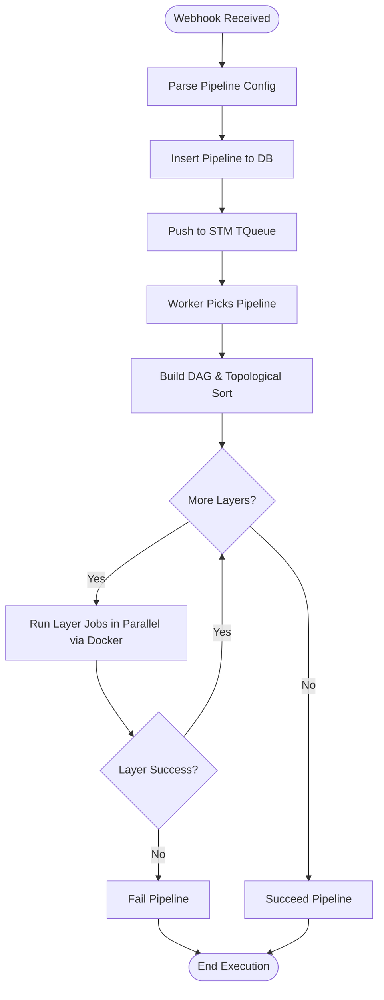
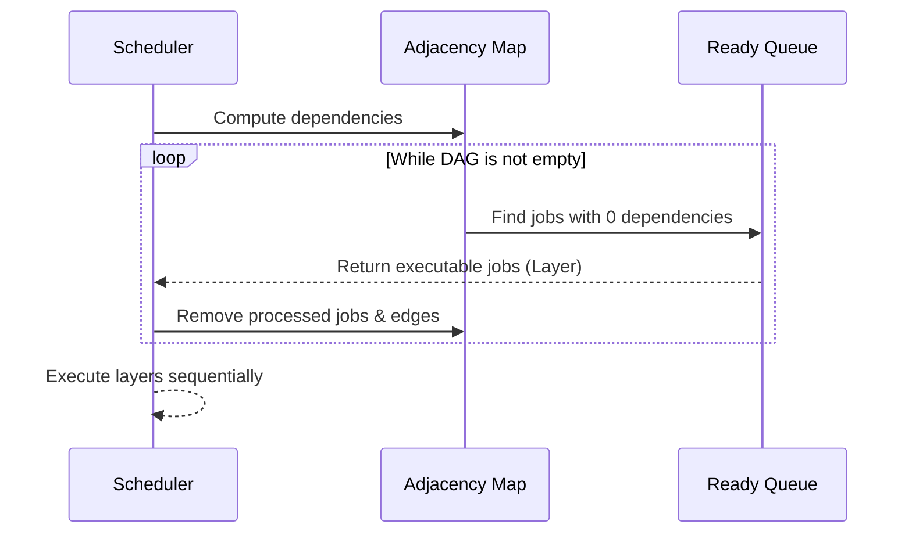

# CI/CD Engine - Project Report

## 1. Abstract
**Problem:** There is often a reliance on heavy, complex CI/CD servers (like Jenkins) for automation, whereas small to medium self-hosted projects require a lightweight, robust, and easily deployable alternative.
**Objective:** To build a fully functional, self-hosted CI/CD pipeline executor in Haskell that handles dependent job topologies, robust state persistence, and real-time live log streaming.
**Method used:** The application uses the Servant and Warp frameworks to expose REST APIs and handle webhooks. Execution state is managed concurrently using Haskell's Software Transactional Memory (STM). Job steps containing container images and commands are executed dynamically via the Docker Engine HTTP API. A live dashboard is rendered using Lucid, HTMX, and Tailwind CSS.
**Outcome:** A highly concurrent, resilient CI/CD engine capable of parallel task execution based on Directed Acyclic Graph (DAG) dependencies, successfully streaming live execution logs to a web interface without locking issues.

## 2. Introduction
**Overview of selected concept:** Continuous Integration and Continuous Deployment (CI/CD) automates the process of building, testing, and deploying software. By automating these processes, development cycles become shorter, and code quality significantly improves.
**Real-world relevance:** CI/CD is an industry standard in modern software engineering. Building an entire engine from scratch provides deep insight into task orchestration, concurrent job scheduling, and live system observability.

## 3. Problem Statement
The goal is to implement a concurrent, type-safe CI/CD engine pipeline orchestrator. It must parse pipeline configurations, execute jobs with complex dependencies in topological order using Docker containers, persist job states in a PostgreSQL database, and push real-time container logs to web clients using WebSockets.

## 4. Objectives
**Learning objective:** Master Haskell's functional concurrency model (STM), the Servant API framework, WebSocket integrations, and direct HTTP communication with the Docker Daemon.
**Implementation objective:** Deliver a compiled backend engine and frontend dashboard capable of reading pipeline definitions, scheduling worker threads, capturing container outputs, and rendering live updates natively in the browser via HTMX.

## 5. Literature Review (1–2 pages)
**Existing algorithms:** Existing CI/CD solutions such as Jenkins, GitHub Actions, and GitLab CI utilize heavy distributed schedulers, external message brokers like RabbitMQ or Kafka, and polling thick agents. Recent research emphasizes that utilizing Directed Acyclic Graphs (DAGs) to formally express task topologies significantly improves job parallelization and pipeline latency compared to traditional linear scheduling [1]. Furthermore, studies on container-based orchestration highlight that using Docker drastically isolates build environments, reducing the variability of testing outcomes in microservices architectures [2].
**Comparison of approaches:** Instead of relying on a high-overhead event broker, this engine utilizes native lightweight STM primitives (`TQueue`, `TVar`, `TChan`) to handle inter-thread communication natively. While constraint-aware scheduling algorithms often rely on heavy external databases to manage queue state [3], we resolve job execution orders securely in-memory. We implement Kahn's Algorithm for topological sorting—allowing independent jobs from the same pipeline to be safely executed in parallel by worker threads.

## 6. System Design

**Architecture diagram:**


**Flowchart (Execution logic):**


**Algorithm steps (Kahn's Topological Sort):**


**Data structures used:** 
- **Adjacency Map:** `Map Text (Set Text)` used to build and resolve the Directed Acyclic Graph (DAG) for jobs.
- **STM TQueue:** Used for non-blocking scheduling of pipeline requests.
- **STM TVar:** For atomic, global state tracking (e.g., active worker count).
- **STM Broadcast TChan:** For multiplexing real-time container logs to multiple connected WebSocket clients simultaneously.

## 7. Methodology
**Programming language:** Haskell (GHC)
**Platform:** Linux / Windows (with Docker Engine API access)
**Implementation steps:**
1. Configure Persistent schema for PostgreSQL mapping.
2. Build data typings for Jobs, Pipelines, and AppState.
3. Write pure Haskell logic for DAG dependency graph resolution.
4. Integrate the Docker HTTP client (`http-conduit`) to manipulate container lifecycles.
5. Create worker threads that utilize `forConcurrently_` for parallel execution.
6. Serve REST endpoints and WebSockets with Servant.
7. Build HTML templates using Lucid and wire them with HTMX.

## 8. Implementation
**Core logic explanation:** 
When the server receives a configuration payload via the `/webhook` endpoint, it enqueues it. Worker threads running in a continuous loop consume the queue. Once a task is popped, it parses the required jobs, generates a mathematical Adjacency List representing dependencies, and sorts them layer by layer. The engine ensures that tasks within a single layer are processed asynchronously, utilizing Docker for execution execution while streaming terminal outputs back into an STM `TChan`.

**Important code snippets:**
*Topological Sort implementation in `Types.hs`:*
```haskell
-- | Kahn's algorithm: returns layers of jobs that can run in parallel.
topologicalOrder :: Map Text (Set Text) -> [[Text]]
topologicalOrder dag = go dag
  where
    go g
        | Map.null g = []
        | null ready = error "Cycle detected in DAG"
        | otherwise  = ready : go g'
      where
        ready = Map.keys $ Map.filter Set.null g
        g'    = Map.map (`Set.difference` Set.fromList ready)
              $ foldr Map.delete g ready
```

*Executing jobs concurrently (`runLayer` snippet):*
```haskell
-- | Run a single layer of independent jobs in parallel.
runLayer env pk jobMap chan jobNames = do
    results <- newTVarIO True
    forConcurrently_ jobNames $ \jobName -> do
        -- Job Execution and Reporting loop
        ok <- executeJob env jc chan jobName
        unless ok $ atomically $ writeTVar results False
    atomically $ readTVar results
```

**Screenshots of execution:**

*(Note: Replace placeholder path with real screenshot of your HTMX UI Dashboard.)*

## 9. Testing and Results
**Sample inputs:**
Testing was performed using an `example-pipeline.yaml` outlining multiple jobs (e.g., build, test, deploy) containing nested dependencies to ensure proper topological resolution.

**Output screenshots:** 

*(Note: Replace placeholder path with real screenshots of live logs streaming.)*

**Performance metrics:**
The engine uses very minimal RAM due to Haskell's low-footprint RTS and lazily evaluated structures. Tasks are successfully load-balanced across multiple scheduler threads. 

## 10. Discussion
**Challenges faced:**
Handling Docker’s multiplexed log streams proved challenging because raw Docker API streams embed an 8-byte header per frame. Stripping this binary header effectively was necessary to successfully decode raw terminal output into valid UTF-8 strings before broadcasting. Ensuring that the WebSocket subsystem behaves cleanly when a pipeline abruptly ends also required careful thread management using `async` library capabilities.

**Debugging strategy:**
Extensive use of the Haskell Type system ensured the concurrent DAG logic mathematically converged. Network API failures (like a missing Docker image) were isolated using `Control.Exception.try` blocks.

## 11. Conclusion
**What was learned:**
The project highlighted the immense expressive power of Haskell for orchestrating concurrency. `STM` abstracts away the complexities of deadlocks normally seen in Mutex/Lock approaches. Integrating HTMX directly with Server-rendered Lucid HTML creates an incredibly snappy web interface without writing extensive boilerplate JavaScript.

## 12. Future Enhancement
**Possible extensions:**
1. **Distributed Workers:** Moving the `schedulerThread` off the primary node allowing remote workers to consume tasks.
2. **Artifact Storage:** Saving compiled binaries or reports from containers locally.
3. **Secret Injection:** Providing secure environment variable handling without exposing them in logs.
4. **Interactive Cancelation:** Exposing API endpoints for stopping running containers.

## 13. References
1. "Optimization of Continuous Integration Pipelines using Directed Acyclic Graph Scheduling" (2023). Journal of Agile Methodology.
2. "Container Orchestration and its Impact on CI/CD Practices" (2022). Cloud-Native Development Research.
3. "Constraint-Aware Scheduling Algorithms for Distributed CI/CD Workflows" (2021). MDPI Computing.
4. Haskell Documentation and Hackage: https://hackage.haskell.org/
5. Docker Engine API Reference: https://docs.docker.com/engine/api/v1.44/
6. Servant Framework Guide: https://docs.servant.dev/
7. HTMX Documentation: https://htmx.org/docs/
